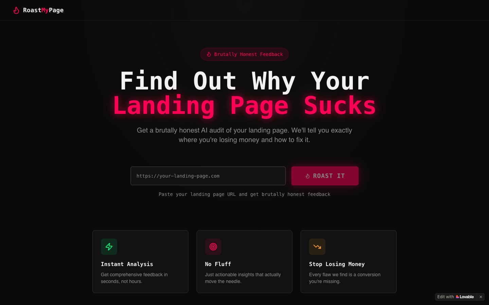

# Roast My Page

**Paste a landing page URL and get brutally honest AI feedback on its design, copy and UX: what's costing you conversions and how to fix it.**

[Try it →](https://roastmypage.lovable.app)

## The problem

Founders and indie makers rarely get honest feedback on their landing pages. Friends are polite, proper UX reviews cost money and take days, and generic checklists don't say what's wrong with *this* page. Meanwhile an unclear headline or a buried call to action quietly costs sign-ups.

## What it does

- **Paste a URL,** with no sign-up needed.
- **The page is read and analysed** for design and layout, copywriting, user experience, and clarity and conversion.
- **You get a "roast":** blunt, entertaining feedback that names specific problems and how to fix them.

<strong>Tech stack</strong>

React, TypeScript, Vite, Tailwind CSS, Supabase Edge Function for page fetching and analysis, LLM-generated feedback. Built and hosted with Lovable.

